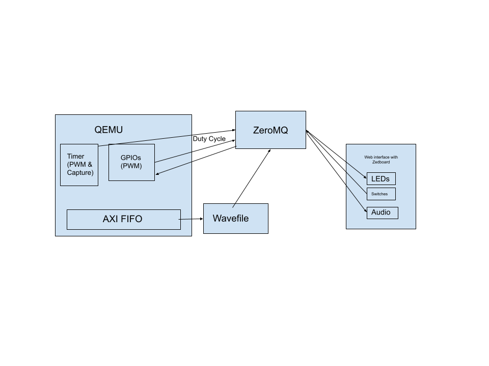

# Extending QEMU Hardware Emulator

## Description

Our project goal is to extend the QEMU emulator to model additional ZedBoard hardware. Currently, QEMU uses ZeroMQ to send GPIO events to a zpanel web interface. We will be adding the ability to send PWM signals from the GPIOs in the format of a duty cycle. This will then control the brightness of the LEDs on the web interface. The timer implementation will also be added to pass the duty cycle of the PWM signal generated by the timer to the web interface. Finally the AXI FIFO will be modeled in QEMU. The FIFO data will be converted to a wavefile then sent to the web interface to be played. The AXI FIFO will support overflow and underflow. To implement all of these, timing will be represented in QEMU. This will allow the GPIOs, PWM signals, and the AXI FIFO to be instantiated and manipulated in software to observe their behavior without a need for the hardware.

## System Diagram

## Team Members and Responsibilities

- AXI FIFO: Kaylin
- GPIO/PWM: Kelly
- Timer: Tanvi
- Web interface: Caleb
